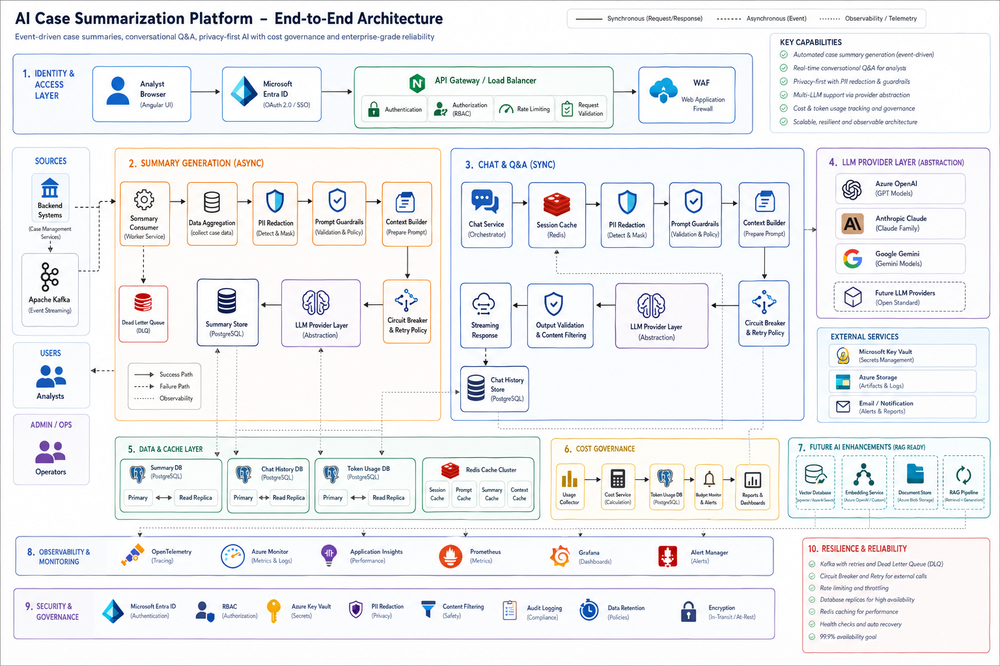

# CasePilot V2 — Architecture

**Author:** Bhupender Kumar | **Last updated:** June 2026

## What is CasePilot?

CasePilot is an internal AI platform that helps security analysts investigate and resolve customer cases faster. Instead of pulling data from five different systems and writing up findings manually, analysts get auto-generated summaries and can ask follow-up questions in a chat interface.

V2 is a full rewrite. V1 was a straightforward "call GPT and return the response" integration. It worked, but it had no failover, no cost controls, no prompt versioning, and PII was going straight to the provider. V2 treats AI as a managed platform concern — with an orchestration layer, provider abstraction, security pipeline, and proper observability.

### Goals

- Cut investigation time by auto-summarizing case data from multiple sources
- Give analysts a chat interface to ask questions about a case
- Never send unredacted PII to an LLM provider
- Track every AI request (who, what, which model, how many tokens, how much it cost)
- Handle provider outages gracefully — retry, failover, don't lose the request
- Keep LLM costs visible and under control



---

## The Problem

An analyst working a case typically has to:

1. Look up the customer in the CRM
2. Pull payment/transaction history
3. Check session logs
4. Cross-reference with previous cases
5. Write a summary from all of that

This takes time, the quality varies analyst to analyst, and it doesn't scale. CasePilot automates steps 1–5 and gives the analyst a starting point they can verify and build on.

---

## Architecture Overview

There are three main flows:

1. **Summary generation** — async, Kafka-driven, runs when a case is created or updated
2. **Chat Q&A** — real-time, analyst asks questions about a case, gets streamed responses
3. **Cost tracking** — every AI call logs token usage and cost to a dedicated service

Everything goes through a shared security pipeline (PII redaction, prompt injection detection, guardrails) and a shared AI Orchestrator before hitting any LLM.

### Services

```
services/
├── api-gateway/          # Auth, RBAC, routing, rate limiting
├── summary-consumer/     # Kafka consumer → data aggregation → summary generation
├── chat-service/         # Session management, conversation flow, SSE streaming
├── ai-orchestrator/      # Model routing, failover, retry, token/cost tracking
├── prompt-service/       # Versioned prompt templates, A/B testing
├── pii-redaction/        # Strips PII before anything hits an LLM
├── llm-provider/         # Provider abstraction (Azure OpenAI, Claude, Gemini)
├── context-builder/      # Turns raw case data into structured prompts
├── cost-service/         # Per-request cost tracking, budget alerts
└── audit-service/        # Full request-level audit trail
```

---

## Summary Generation

This is the async path. A case event lands on Kafka, and the summary-consumer picks it up.

**Flow:**

1. Case event → Kafka → Summary Request Queue
2. Worker pool pulls the request, fetches data from case management, customer info, payments, session logs
3. Data goes through the security pipeline — PII redaction, injection detection, guardrails
4. Context Builder structures it into a prompt-ready format
5. AI Orchestrator picks the model/provider, manages retries, tracks tokens
6. LLM generates the summary
7. Result goes to Summary Result Queue → persisted to the Summary DB

If anything fails, the request goes to a retry queue. If it keeps failing, it lands in a DLQ so we can investigate without losing the request.

The whole thing is decoupled from the case management system — summary generation scales independently.

---

## Chat & Q&A

This is the real-time path. An analyst opens a case and asks a question.

**Flow:**

1. Request comes through the API Gateway → Chat Service
2. Chat Service loads conversation history from Redis
3. Same security pipeline as summaries — PII redaction, injection detection, guardrails
4. Context Builder adds relevant case data to the prompt
5. AI Orchestrator routes to the right model/provider
6. Response streams back via SSE
7. Conversation gets saved to the Chat DB

Chat has its own retry queue and DLQ, separate from summary generation.

---

## AI Orchestrator

This is the piece that makes V2 different from V1. No service talks to an LLM directly — everything goes through the orchestrator.

It handles:

- **Model selection** — pick the right model for the task (e.g., GPT-4o for complex summaries, a lighter model for simple Q&A)
- **Provider routing** — Azure OpenAI primary, Claude or Gemini as fallback
- **Retry logic** — exponential backoff on transient failures
- **Failover** — if Azure is rate-limited or down, route to Claude
- **Prompt versioning** — every request uses a specific prompt template version
- **Token tracking** — count input/output tokens per request
- **Cost calculation** — token count × provider pricing
- **Response validation** — basic checks on the LLM output before returning it

This means business services (summary-consumer, chat-service) don't need to know anything about LLM providers, retry strategies, or cost tracking. They just send a request to the orchestrator and get a response.

---

## LLM Provider Layer

Wraps the actual API calls to LLM vendors. Currently supports:

- **Azure OpenAI** (primary) — enterprise SLA, EU data residency
- **Anthropic Claude** (fallback) — good for longer context windows
- **Google Gemini** (fallback) — cost optimization for simpler tasks

Adding a new provider means implementing the provider interface. Nothing upstream changes.

If Azure returns a 429 (rate limit), the orchestrator either retries after the backoff window or routes to Claude. The analyst never sees the failure.

---

## Prompt Management

Prompts are versioned and stored in the Prompt Service database. Every AI response is tagged with the prompt version that generated it.

This gives us:

- **Rollback** — if a new prompt version produces worse results, roll back in seconds
- **A/B testing** — run two prompt versions side by side, compare output quality
- **Audit trail** — for any generated summary, you can see exactly which prompt was used
- **Governance** — prompt changes go through the service, not hardcoded in application code

---

## Security

The platform handles customer data, so security isn't optional.

| Layer | What it does |
|---|---|
| **Microsoft Entra ID** | Authentication and identity |
| **RBAC** | Role-based access at the API Gateway |
| **PII Redaction** | Strips names, emails, account numbers, etc. before LLM calls |
| **Prompt Injection Detection** | Catches attempts to manipulate the LLM through user input |
| **Prompt Guardrails** | Validates that prompts stay within policy boundaries |
| **Secrets Management** | API keys in Key Vault, not in config files |
| **Audit Logging** | Every AI interaction logged with user, case, model, tokens, cost |

PII redaction runs before the data ever leaves our infrastructure. The LLM provider never sees raw customer data.

---

## Data & Caching

Each service owns its own PostgreSQL database — chat, summaries, audit, cost, and prompts are all separate. This keeps services independent and lets them scale on their own.

Redis handles caching across several domains:

- **Session cache** — active conversation state for chat
- **Context cache** — pre-built context payloads to avoid re-fetching
- **Summary cache** — frequently accessed summaries
- **Response cache** — avoid duplicate LLM calls for the same question
- **Rate limit counters** — request throttling

The response cache alone saves a meaningful amount on LLM costs — if three analysts ask the same question about the same case within a short window, only the first one hits the LLM.

---

## Audit Trail

Every AI request gets logged with:

- User ID, Case ID
- Prompt version used
- Provider and model
- Input/output token count
- Cost
- Response status
- Timestamp and correlation ID

This covers compliance requirements and also helps with debugging. If an analyst reports a bad summary, we can pull the exact prompt, context, and model version that produced it.

---

## Cost Tracking

LLM costs add up fast if you're not watching them. The cost-service tracks:

- Token usage per request
- Cost per request (based on provider pricing)
- Aggregated cost by service, team, and time period
- Budget alerts when spend crosses thresholds

Usage events flow through Kafka to the cost-service, which stores everything in a dedicated database and exposes dashboards.

---

## Reliability

The platform is built to handle failures without losing requests:

- **Retry queues** — transient failures get retried with backoff
- **Dead letter queues** — persistent failures get isolated for manual investigation
- **Circuit breakers** — if a provider is consistently failing, stop sending it traffic
- **Provider failover** — automatic routing to backup providers
- **Idempotency** — duplicate requests are detected and deduplicated
- **Health checks** — continuous monitoring with alerting

---

## Monitoring

Standard observability stack:

- Centralized logging (structured JSON)
- Metrics (request latency, token usage, error rates, queue depth)
- Distributed tracing (correlation IDs across services)
- Alerting (PagerDuty/Slack integration)
- Dashboards (Grafana)

---

## What Changed from V1 to V2

| Area | V1 | V2 |
|---|---|---|
| LLM integration | Direct API calls from business services | Centralized AI Orchestrator |
| Provider support | Single provider (OpenAI) | Multi-provider with failover (Azure OpenAI, Claude, Gemini) |
| PII handling | None — raw data sent to provider | PII redaction pipeline before any LLM call |
| Prompt management | Hardcoded strings | Versioned Prompt Service with rollback and A/B testing |
| Cost visibility | None | Per-request token/cost tracking with budget alerts |
| Failure handling | Fail and retry at app level | Retry queues, DLQs, circuit breakers, provider failover |
| Audit | Basic logging | Full request-level audit trail (user, case, model, tokens, cost) |
| Security | API key in env vars | Entra ID, RBAC, injection detection, guardrails, Key Vault |
| Chat | Not available | Real-time Q&A with SSE streaming and session management |
| Architecture | Monolithic | Event-driven microservices with service-owned databases |

---

## V3 Roadmap

Things we're planning or exploring for the next iteration:

- **RAG pipeline** — vector database (pgvector or Pinecone) + embedding service for semantic retrieval over case history. Right now the context builder fetches structured data; RAG would let analysts search unstructured documents too.
- **Multi-agent workflows** — break complex investigations into sub-tasks handled by specialized agents (e.g., one agent for transaction analysis, another for session correlation), orchestrated via LangGraph.
- **Human feedback loop** — analysts rate summary quality, feed that back into prompt optimization and model evaluation.
- **Semantic search** — let analysts search across all historical cases using natural language instead of keyword matching.
- **Automated model selection** — use task complexity scoring to route simple questions to cheaper/faster models and complex analysis to more capable ones.
- **Evaluation framework** — automated scoring of LLM outputs against ground truth datasets to catch quality regressions before they hit production.
