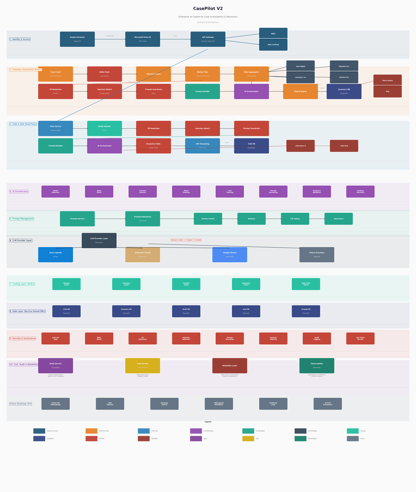

# CasePilot V2

### Enterprise AI Copilot for Case Investigation & Resolution

An enterprise-grade AI platform that helps analysts investigate and resolve cases faster through automated summarization and conversational Q&A.

> **V2 moves from calling an LLM to operating an AI platform.**

## Documentation

| Document | Description |
|---|---|
| [`ARCHITECTURE.md`](./ARCHITECTURE.md) | Full architecture — AI Orchestrator, provider abstraction, prompt governance, security, reliability |

## Architecture



## Project Structure

```
CasePilot/
├── ARCHITECTURE.md
├── README.md
├── docs/
│   └── images/
│       └── final_architecture.png
└── services/
    ├── api-gateway/          # Authentication, RBAC, routing, rate limiting
    ├── summary-consumer/     # Kafka consumer, worker pool, summary generation
    ├── chat-service/         # Conversation orchestrator, session mgmt, SSE streaming
    ├── ai-orchestrator/      # Model selection, failover, token/cost tracking, prompt versioning
    ├── prompt-service/       # Versioned prompt templates, A/B testing, rollback
    ├── pii-redaction/        # Privacy layer — redacts PII before LLM calls
    ├── llm-provider/         # Multi-provider abstraction (Azure OpenAI, Claude, Gemini)
    ├── context-builder/      # Structured prompt construction
    ├── cost-service/         # Token usage tracking, budget controls
    └── audit-service/        # AI request logging, compliance, traceability
```

## Services

| Service | Responsibility |
|---|---|
| **API Gateway** | Authentication, authorization, routing, rate limiting |
| **Summary Consumer** | Kafka event processing, worker pool, data aggregation, summary workflow |
| **Chat Service** | Conversation management, session handling, SSE streaming |
| **AI Orchestrator** | Model selection, retry policy, provider failover, token/cost tracking, prompt versioning, response validation |
| **Prompt Service** | Versioned prompt templates, rollback, A/B testing |
| **PII Redaction** | Privacy protection — masks sensitive data before LLM calls |
| **LLM Provider** | Multi-provider abstraction with automatic failover (Azure OpenAI, Claude, Gemini) |
| **Context Builder** | Structured prompt construction from case data |
| **Cost Service** | Per-request token and cost tracking, budget enforcement |
| **Audit Service** | Full AI request traceability — user, case, model, tokens, cost, timestamp |

## Core Design Principles

| Principle | Description |
|---|---|
| Security First | No sensitive data leaves the platform unredacted |
| Failure Tolerant | Retry queues, DLQs, circuit breakers, provider failover |
| Provider Agnostic | LLM Provider Layer abstracts all AI vendors |
| Event Driven | Kafka-based async processing for summary generation |
| Auditable | Every AI request tracked with full traceability |
| Cost Aware | Per-request token and cost tracking with budget controls |
| Prompt Governed | Versioned prompts with rollback, guardrails, injection detection |
| Horizontally Scalable | Stateless services, worker pools, independent databases |

## Design Decisions

| Decision | Reason |
|---|---|
| AI Orchestrator | Central governance for all AI interactions |
| Kafka | Reliable asynchronous processing |
| Redis | Low-latency caching (sessions, summaries, rate limits) |
| PostgreSQL | Strong transactional consistency per service |
| Service-Owned DBs | Isolation, independent scaling, clear ownership |
| Azure OpenAI (primary) | Enterprise SLA, EU data residency |
| Claude / Gemini (fallback) | Provider failover and cost optimization |
| Prompt Service | Versioning, rollback, auditability, A/B testing |
| PII Redaction | Defense in depth — compliance and privacy |
| Idempotency Store | Prevent duplicate summaries on event replay |
| DLQ | Capture failed messages for investigation and replay |
