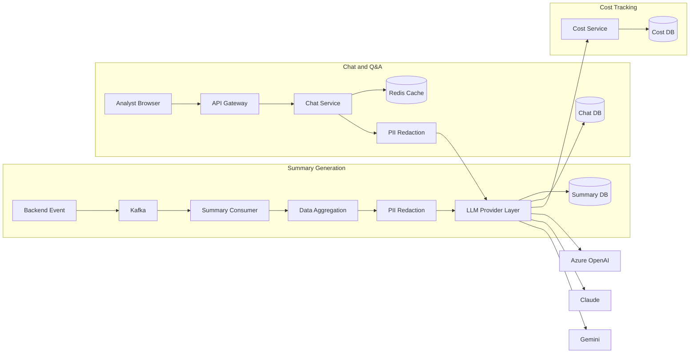

# Main Architecture Diagram

```mermaid
flowchart LR

subgraph Summary Generation

Backend[Backend Event]
Kafka[Kafka]
SummaryConsumer[Summary Consumer]
DataAggregation[Data Aggregation]
PIIRedaction[PII Redaction]
LLM[LLM Provider Layer]
SummaryDB[(Summary DB)]

Backend --> Kafka
Kafka --> SummaryConsumer
SummaryConsumer --> DataAggregation
DataAggregation --> PIIRedaction
PIIRedaction --> LLM
LLM --> SummaryDB

end

subgraph Chat and Q&A

Browser[Analyst Browser]
Gateway[API Gateway]
ChatService[Chat Service]
Redis[(Redis Cache)]
PIIChat[PII Redaction]
ChatDB[(Chat DB)]

Browser --> Gateway
Gateway --> ChatService
ChatService --> Redis
ChatService --> PIIChat
PIIChat --> LLM
LLM --> ChatDB

end

subgraph Cost Tracking

CostService[Cost Service]
CostDB[(Cost DB)]

LLM --> CostService
CostService --> CostDB

end

AzureOpenAI[Azure OpenAI]
Claude[Claude]
Gemini[Gemini]

LLM --> AzureOpenAI
LLM --> Claude
LLM --> Gemini
```
