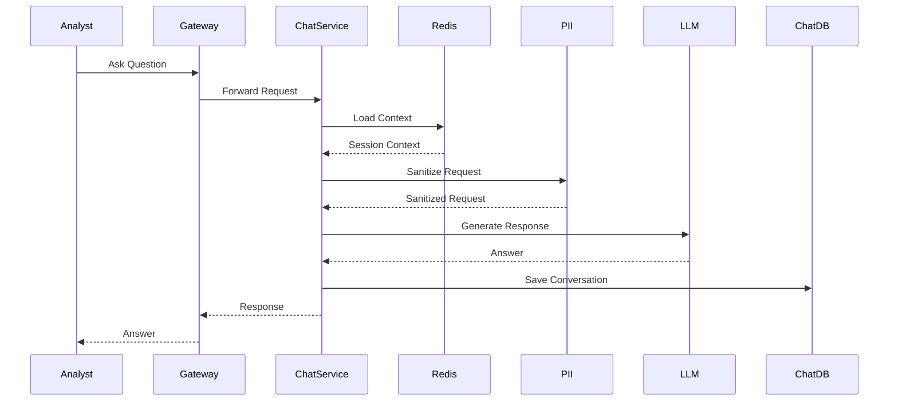

# Chat Sequence Diagram

```mermaid
sequenceDiagram

participant Analyst
participant Gateway
participant ChatService
participant Redis
participant PII
participant LLM
participant ChatDB

Analyst->>Gateway: Ask Question

Gateway->>ChatService: Forward Request

ChatService->>Redis: Load Context

Redis-->>ChatService: Session Context

ChatService->>PII: Sanitize Request

PII-->>ChatService: Sanitized Request

ChatService->>LLM: Generate Response

LLM-->>ChatService: Answer

ChatService->>ChatDB: Save Conversation

ChatService-->>Gateway: Response

Gateway-->>Analyst: Answer
```
