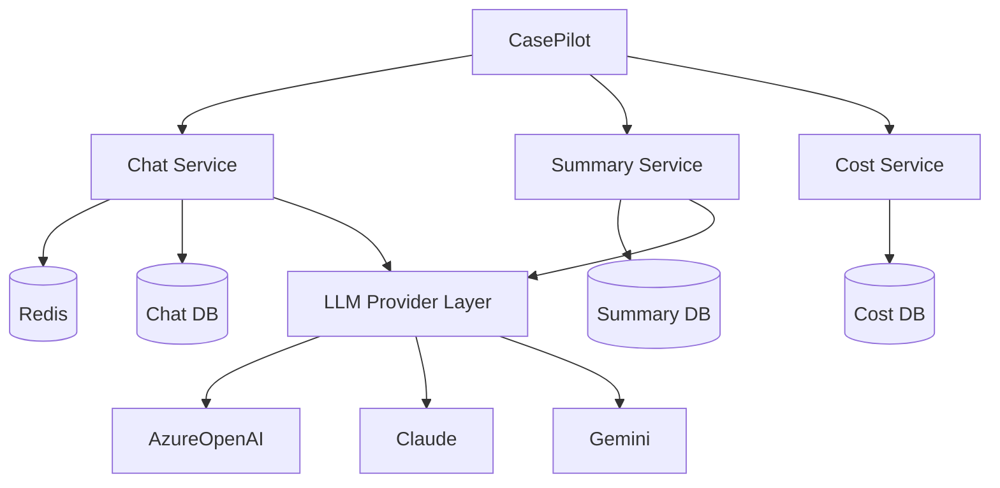

# Component Diagram

```mermaid
flowchart TB

CasePilot[CasePilot]

ChatService[Chat Service]
SummaryService[Summary Service]
CostService[Cost Service]

LLMProvider[LLM Provider Layer]

Redis[(Redis)]
SummaryDB[(Summary DB)]
ChatDB[(Chat DB)]
CostDB[(Cost DB)]

CasePilot --> ChatService
CasePilot --> SummaryService
CasePilot --> CostService

ChatService --> Redis
ChatService --> ChatDB

SummaryService --> SummaryDB

CostService --> CostDB

ChatService --> LLMProvider
SummaryService --> LLMProvider

LLMProvider --> AzureOpenAI
LLMProvider --> Claude
LLMProvider --> Gemini
```
