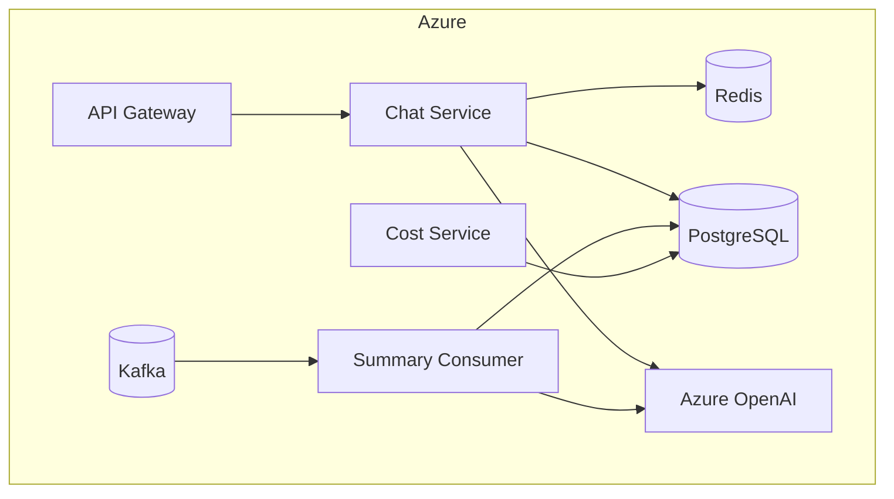

# Deployment Diagram

```mermaid
flowchart TB

subgraph Azure

Gateway[API Gateway]

ChatService[Chat Service]
SummaryConsumer[Summary Consumer]
CostService[Cost Service]

Redis[(Redis)]

Postgres[(PostgreSQL)]

Kafka[(Kafka)]

AzureOpenAI[Azure OpenAI]

end

Gateway --> ChatService

Kafka --> SummaryConsumer

ChatService --> Redis
ChatService --> Postgres

SummaryConsumer --> Postgres

ChatService --> AzureOpenAI
SummaryConsumer --> AzureOpenAI

CostService --> Postgres
```
