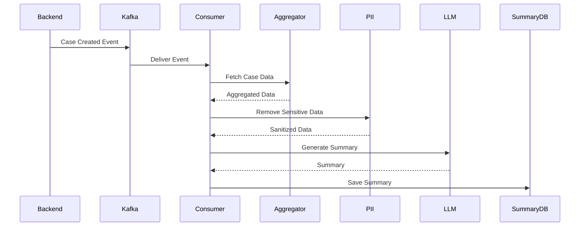

# Summary Generation Sequence Diagram

```mermaid
sequenceDiagram

participant Backend
participant Kafka
participant Consumer
participant Aggregator
participant PII
participant LLM
participant SummaryDB

Backend->>Kafka: Case Created Event

Kafka->>Consumer: Deliver Event

Consumer->>Aggregator: Fetch Case Data

Aggregator-->>Consumer: Aggregated Data

Consumer->>PII: Remove Sensitive Data

PII-->>Consumer: Sanitized Data

Consumer->>LLM: Generate Summary

LLM-->>Consumer: Summary

Consumer->>SummaryDB: Save Summary
```
